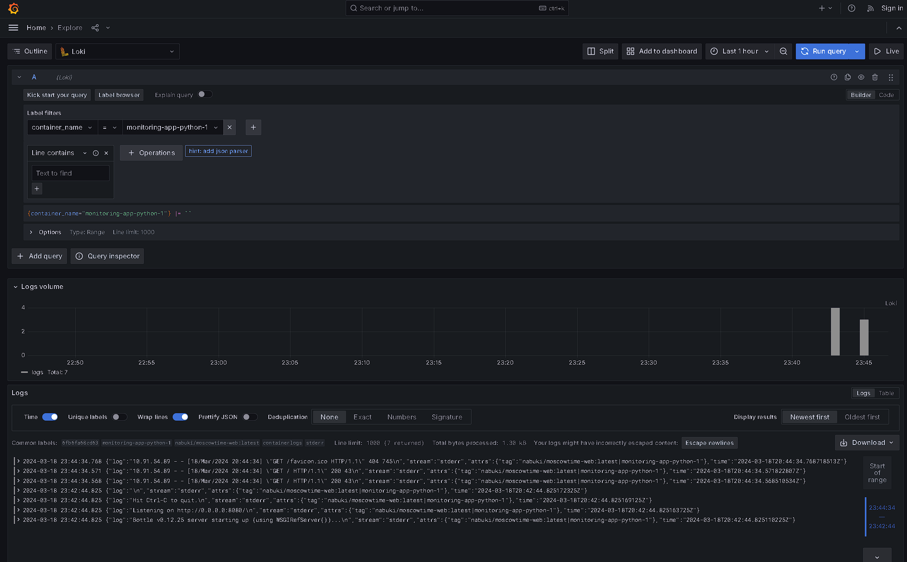

# Logging Stack Documentation

This document outlines the configuration and components of our logging stack, designed to provide a comprehensive logging solution for monitoring and troubleshooting our applications.

## Components

### 1. Loki

Loki is a horizontally-scalable, highly-available, multi-tenant log aggregation system. It is designed to be cost-effective and easy to operate, as it does not index the contents of the logs, but rather a set of labels for each log stream.

In our stack, Loki is configured as a service within our `docker-compose.yml` file. It is responsible for storing logs collected by Promtail and making them queryable via Grafana.

- **Image**: `grafana/loki:2.9.2`
- **Configuration**: Uses a file located at `/etc/loki/local-config.yaml` within the container, based on the command specified in the docker-compose configuration.
- **Port**: Exposed on `3100`, allowing it to receive logs and serve queries.

### 2. Promtail

Promtail is an agent which ships the contents of local logs to a Loki instance or Grafana Cloud. It is designed to watch for logs in specific directories, gather metadata about the logs (like labels), and send this information to Loki.

- **Image**: `grafana/promtail:2.9.2`
- **Configuration**: Defined in `promtail.yaml`, it specifies Loki as the destination for logs at `http://loki:3100/loki/api/v1/push`. It collects logs from `/var/lib/docker/containers/*/*log`, enriches them with metadata, and forwards them to Loki.
- **Volumes**: Maps `promtail.yaml` to the container's `/etc/promtail/config.yml` and the host's Docker container logs directory to the container, enabling log collection.

### 3. Grafana

Grafana is an open-source platform for monitoring and observability. Grafana allows you to query, visualize, alert on, and understand your metrics no matter where they are stored.

- **Image**: `grafana/grafana:latest`
- **Configuration**: Environment variables and an entrypoint script are used to configure Grafana. The script creates a datasource configuration file for Loki, setting it as the default datasource.
- **Port**: Exposed on `3000`, providing access to the Grafana UI where logs can be queried and visualized.

### 4. Application Service (app-python)

This service is an example of an application generating logs that are collected by the stack. It demonstrates how logs from any service in the stack can be forwarded to Loki via Promtail for storage and analysis.

- **Image**: `nabuki/moscowtime-web:latest`
- **Ports**: Maps port `8000` on the host to `8080` on the container, making the application accessible externally.
- **Logging**: Configured to use the default logging driver, facilitating the collection of logs by Promtail.

## Logging Operation

The operation of our logging stack is demonstrated by a screenshot captured at `screenshots/app.png`, showing the successful collection and visualization of logs from our application service in Grafana.

This setup ensures that logs from our services are efficiently collected, stored, and made queryable in a centralized manner, providing valuable insights for monitoring and troubleshooting.